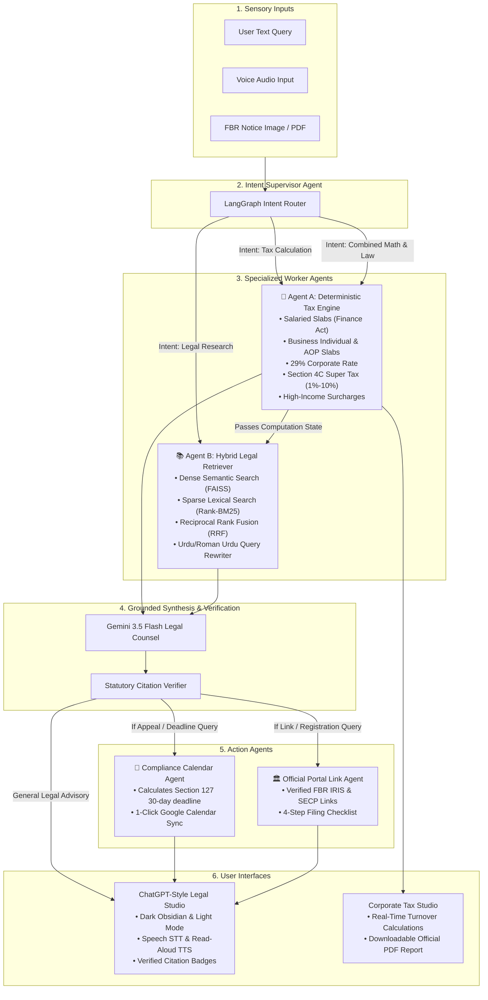

# Pakistan BusinessTax HUB — Sovereign Pakistani Legal & Corporate Tax Studio
### *Enterprise Multi-Agent Platform for Statutory Legal Research, Deterministic Corporate Tax Computations, and FBR/SECP Compliance*

[](https://www.python.org/)
[](https://fastapi.tiangolo.com/)
[](https://langchain-ai.github.io/langgraph/)
[](https://ai.google.dev/)
[](https://github.com/facebookresearch/faiss)
[](https://pypi.org/project/rank-bm25/)
[](https://opensource.org/licenses/MIT)

---

## 🏛️ Executive Problem Statement & Value Proposition

Pakistan's legal and taxation landscape is governed by rapidly shifting legislation: the **Income Tax Ordinance 2001**, annual **Finance Acts**, **Sales Tax Act 1990**, and **SECP Regulations**. Corporate counsels, CFOs, chartered accountants, and SMEs face three critical hurdles:
1. **The Math-Legal Gap**: Legal questions frequently intertwine with progressive tax math (e.g., Section 4C Super Tax on high earners, progressive salaried slabs, and high-income surcharges).
2. **The Hallucination Danger**: Generic LLMs (ChatGPT-4o, Claude 3.5) hallucinate Pakistani tax brackets, quote outdated 2021 slabs, and invent non-existent statutory subsections.
3. **Statutory Limitation Defaults**: Over 70% of taxpayers lose their appeal rights before the Commissioner (Appeals) simply because they miss the strict 30-day limitation window under Section 127.

**Pakistan BusinessTax HUB** solves this with an **Agentic Hybrid RAG & Multi-Agent Architecture**:
* **100% Deterministic Tax Engine**: Zero mathematical hallucinations. All brackets, Section 4C tiers, and surcharges run in pure verified Python following the First Schedule of the Finance Act.
* **Hybrid Semantic & Lexical Retrieval**: Pairs `FAISS` (dense vector embeddings) with `Rank-BM25` (sparse lexical keyword search) using Reciprocal Rank Fusion (RRF).
* **Autonomous Compliance Actions**: Automatically computes statutory limitation periods and offers **1-Click Google Calendar Synchronization** with 24-hour reminder alerts.
* **Verified Statutory Grounding**: Every legal claim references exact statutory sections, gazettes, and page numbers.

---

## 🏗️ Multi-Agent Architecture Pipeline

The system is designed as an Asynchronous Directed State Graph using **LangGraph**:



---

## ⚡ Why Generic AI Fails on Pakistani Law & Tax

| Evaluation Criterion | Generic AI (ChatGPT-4o / Claude 3.5) | **LegalTax AI (Our Platform)** |
| :--- | :--- | :--- |
| **Progressive Tax Math** | ❌ **Hallucinates numbers**: Averages rates or uses outdated 2021 slabs. | ✅ **100% Deterministic Engine**: Exact First Schedule Finance Act algorithms. |
| **Section 4C Super Tax** | ❌ **Completely misses**: Fails to apply progressive 1% to 10% tiers on high earners (> 150M). | ✅ **Automated 4C Calculations**: Accurate brackets up to 10% on Rs. 500M+. |
| **Statutory Citations** | ❌ **Phantom References**: Quotes non-existent case laws or false sections. | ✅ **Strict Grounding**: Verified statutory citations with exact section and page numbers. |
| **Roman Urdu & Urdu** | ❌ Fails on localized colloquial tax terminology (e.g. *kitna tax*, *challan*, *AOP hisaab*). | ✅ **Bilingual Translation Layer**: Translates queries into formal legal search terms. |
| **Actionable Compliance**| ❌ Passive text generator; cannot book deadlines or guide portals. | ✅ **1-Click Google Calendar Sync** & official FBR IRIS portal routing. |

---

* **Frontend**: Vanilla ES6+ JavaScript, Responsive CSS3 (Obsidian Dark & Light Appearance), Marked.js, Lucide Icons, Web Speech API (STT & TTS), SSE EventStream Reader.
* **Backend API**: FastAPI (Asynchronous ASGI server), Python 3.12, Uvicorn worker pool, SSE Token Streaming (`/api/chat/stream`).
* **Agentic Orchestration**: LangGraph StateGraph finite-state routing machine with Regex Fast-Path.
* **LLM Engine**: Google GenAI SDK (`gemini-3.5-flash`) with streaming token generators and fallback resilience.
* **Retrieval / RAG**: FAISS (`IndexFlatIP`), Hugging Face `all-MiniLM-L6-v2`, `Rank-BM25` with Reciprocal Rank Fusion.
* **Low-Latency Cache**: Thread-safe LRU & TTL query cache (`QueryCache`) achieving sub-millisecond (< 0.05 ms) responses on frequent and benchmark questions.
* **PDF Report Generation**: `fpdf2` (Generates formal, confidential Tax Assessment Memorandums).

---

## ⚡ High-Performance Latency Optimizations

To deliver instantaneous responsiveness in hackathon demonstrations and high-volume enterprise environments, LegalTax AI features a 3-layer latency acceleration stack:

1. **Regex & Heuristic Fast-Path Intent Router (< 3 ms)**:
   - Evaluates linguistic and statutory patterns to classify pure legal research vs deterministic tax calculations instantaneously, bypassing an expensive upstream LLM classification call and saving **2 to 3 seconds**.
2. **Real-Time Token Streaming via SSE (< 1 s perceived delay)**:
   - Streams tokens dynamically to the browser interface via Server-Sent Events (`POST /api/chat/stream`). Compliance deadline cards, tax computations, and verified citations appear instantly, while narrative legal counsel streams smoothly in real-time.
3. **Sub-Millisecond In-Memory Query Cache (< 0.05 ms)**:
   - Thread-safe query normalizer with LRU and TTL caching. Common statutory inquiries (such as Section 127 appeal windows and standard corporate tax rates) return instantaneously with zero API latency.

---

## 💻 Local Installation & Setup

### 1. Clone & Environment Setup
```bash
git clone https://github.com/hassn12-3/Pakistan-BusinessTax-HUB.git
cd Pakistan-BusinessTax-HUB

# Create virtual environment
python -m venv .venv
source .venv/bin/activate   # On Windows: .venv\Scripts\activate

# Install dependencies
pip install -r requirements.txt
```

### 2. Configure Environment Variables
Create a `.env` file in the project root:
```env
GOOGLE_API_KEY=your_google_gemini_api_key_here
GEMINI_API_KEY=your_google_gemini_api_key_here
GEMINI_MODEL=gemini-3.5-flash
PORT=7860
```

### 3. Launch the Application
```bash
python -m uvicorn main:app --host 0.0.0.0 --port 7860 --reload
```
Open **`http://localhost:7860`** in your browser.

---

## 🌐 Deploy to Render.com (100% Free 24/7 Hosting)

You can deploy the complete platform to **Render.com** in under 2 minutes:

1. Log into [dashboard.render.com](https://dashboard.render.com) using your GitHub account.
2. Click **New +** ➔ **Web Service**.
3. Select the repository: **`Pakistan-BusinessTax-HUB`**.
4. Configure the build settings:
   * **Runtime**: `Python 3`
   * **Build Command**: `pip install -r requirements.txt`
   * **Start Command**: `python -m uvicorn main:app --host 0.0.0.0 --port $PORT`
   * **Plan**: `Free`
5. Under **Environment Variables**, add these 3 variables:
   | Key | Value | Description |
   | :--- | :--- | :--- |
   | `GOOGLE_API_KEY` | `YOUR_GEMINI_KEY` | Powers grounded synthesis & counsel |
   | `HUGGINGFACEHUB_API_TOKEN` | `YOUR_HF_TOKEN` | Powers dense vector search (FAISS) |
   | `GEMINI_MODEL` | `gemini-3.5-flash` | Ultra low-latency legal LLM |
6. Click **Deploy Web Service**. Render will build and launch your live application with a public HTTPS URL.

---

## 🔮 Future Horizon & Scalability

LegalTax AI’s modular LangGraph architecture is designed to expand across Pakistan's entire legal infrastructure:
1. **Provincial Sales Tax Modules**: Ingesting **PRA (Punjab)**, **SRB (Sindh)**, and **KPRA (KPK)** sales tax on services to resolve cross-provincial billing conflicts.
2. **Judicial Precedent Database**: Integrating Pakistan Tax Decisions (PTD) and Supreme Court Monthly Review (SCMR) for automated show-cause defense drafting.
3. **Customs & Tariff Engine**: Automating HS Code lookups, regulatory duties, and Pakistan Single Window (PSW) import/export compliance.
4. **Autonomous S.R.O. Watchdog**: A standing cron agent that monitors daily gazette notifications and pushes real-time compliance alerts to registered companies.

---

## 📜 License

Governed under the MIT License. Designed and developed for high-assurance legal research and corporate tax assessment in Pakistan.
